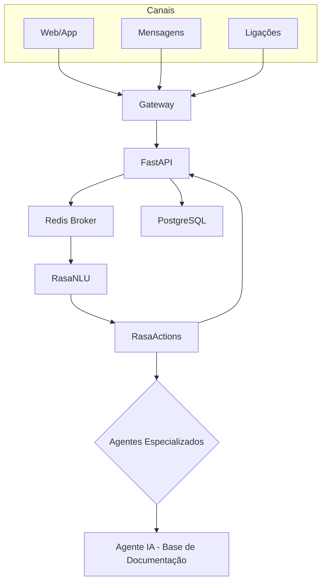
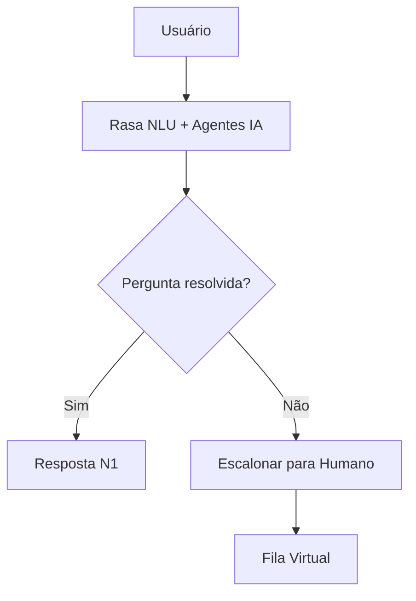
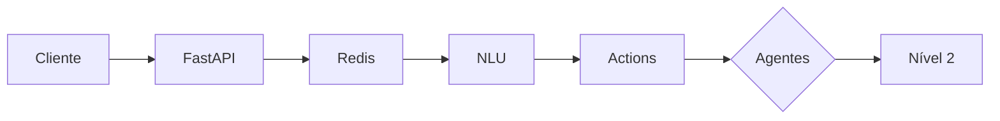

# Arquitetura Piloto - Assistente Digital Omnichannel

Este documento apresenta uma proposta de arquitetura inicial para suportar **1 milhão de usuários** utilizando somente tecnologias open source. A solução deve possibilitar deploy em qualquer provedor de nuvem (AWS, Azure ou GCP) e também em ambientes on‑premise.

## Visão Geral

- **Frontend:** Aplicações web/mobile e integrações com apps de mensagens e ligações telefônicas.
- **Backend:** API principal em **Python + FastAPI**.
- **NLP:** **Rasa NLU** para compreensão de linguagem natural e **Rasa Actions** para orquestrar diálogos avançados.
- **Dados:** **PostgreSQL** como banco relacional e **Redis** para filas e cache.
- **Orquestração:** Contêineres Docker gerenciados por **Kubernetes**.
- **Escalabilidade:** Componentes stateless dimensionados horizontalmente e serviços de dados em instâncias gerenciadas.
 
### Referência: API CNJ
A documentação oficial da Plataforma Digital do Poder Judiciário destaca o uso de microsserviços em Java com Spring, gateways e mensageria para integração. Nossa arquitetura mantém compatibilidade e adiciona os serviços de atendimento em Python.

## Diagrama de Alto Nível

## Componentes Principais

### 1. Camada de Entrada

- **Gateways HTTP/WebSocket** expostos por um balanceador de carga (Ingress) do Kubernetes.
- **Adaptadores de canal**: módulos para Web, WhatsApp/Telegram, e chamadas telefônicas via gateways SIP/VoIP.

### 2. API FastAPI

- Responsável por autenticação, autorização e registro de protocolos.
- Exposição de endpoints REST e WebSocket para integração com o frontend.
- Comunicação com Redis para filas de mensagens e com PostgreSQL para dados persistentes.

### 3. Rasa NLU e Rasa Actions

- Instâncias de Rasa servindo modelos treinados de NLU.
- Rasa Actions executando lógicas personalizadas (consulta de dados, integração com sistemas legados, etc.).
- Conectadas ao Redis (para fila de eventos) e ao PostgreSQL (para armazenar contextos persistentes).

#### Agentes Especializados

Rasa Actions atua como hub para múltiplos agentes especializados. Cada agente pode ser um serviço independente (humano ou IA) responsável por um tipo de atendimento:

- **Suporte Técnico** e **Serviços do Portal** – ajudam em navegação e peticionamento.
- **Orientação Processual** – explica andamentos judiciais.
- **Agente IA Base de Conhecimento** – indexa a documentação do projeto e responde em linguagem simples.

Todos se conectam via mensagens assíncronas, permitindo escalonamento e registro de histórico.

### 4. Banco de Dados PostgreSQL

- Cluster configurado em modo replicado (master + réplicas) para suportar alta concorrência.
- Armazena informações de usuários, históricos de conversa, protocolos e telemetria.

### 5. Redis

- Utilizado como broker de mensagens entre componentes (API, Rasa) e como cache de sessões.
- Pode ser configurado em modo cluster para maior disponibilidade e desempenho.

### 6. Monitoramento e Logs

- **Prometheus** e **Grafana** para métricas.
- **ELK (Elasticsearch, Logstash, Kibana)** ou **Loki** para centralização de logs.
- Alertas configurados via Prometheus Alertmanager.

## Fluxo de Conexões

1. O usuário acessa o canal (web, app de mensagens ou telefone).
2. O adaptador do canal encaminha as mensagens para a API FastAPI via REST/WebSocket.
3. A API registra o protocolo em PostgreSQL, publica a mensagem no Redis e responde com o ticket de rastreamento.
4. O Rasa NLU consome as mensagens do Redis, processa o entendimento e envia para o Rasa Actions.
5. O Rasa Actions decide se a resposta vem da base de conhecimento (Nível 1) ou se é necessário escalonar (Nível 2), alimentando novamente a fila no Redis.
6. A resposta final é lida pela API e entregue ao usuário pelo mesmo canal.
## Fluxogramas de Atendimento

## Dimensionamento Inicial

- **Pods FastAPI:** 4 réplicas (com auto scaling até 20) rodando em contêineres leves (ex.: `uvicorn-gunicorn-fastapi`).
- **Pods Rasa NLU:** 4 réplicas escaláveis conforme volume de mensagens.
- **Pods Rasa Actions:** 4 réplicas com acesso às bibliotecas de negócio.
- **PostgreSQL:** instância inicial com 2 vCPU/4 GB RAM e replicação para leitura.
- **Redis:** cluster com 3 nós (master + 2 réplicas) para alta disponibilidade.
- **Kubernetes:** cluster com ao menos 3 nós de aplicação (4 vCPU/8 GB RAM cada) e 3 nós para serviços de dados.

Este dimensionamento atende picos de até 1 milhão de usuários considerando uso majoritariamente assíncrono (fila de mensagens) e permite crescimento linear adicionando mais réplicas.

## Portabilidade entre Nuvens

- Todos os componentes utilizam imagens Docker e manifestos Kubernetes.
- Não há dependência de serviços proprietários de nuvem.
- Armazenamento pode ser provisionado por volumes persistentes padrão (EBS, Disk, etc.) de cada provedor.
- Para mensageria externa (WhatsApp, SMS, voz) utilizam-se APIs independentes (ex.: Twilio ou equivalentes open source). Estas integrações podem ser trocadas conforme o provedor.

## Próximos Passos

1. Definir pipelines de CI/CD (GitHub Actions ou GitLab CI) para construção e deploy automático em clusters Kubernetes.
2. Criar templates de infraestrutura como código (Terraform ou Helm charts) para facilitar replicação em diferentes ambientes.
3. Configurar políticas de segurança, backups e testes de carga para validar a escala desejada.
